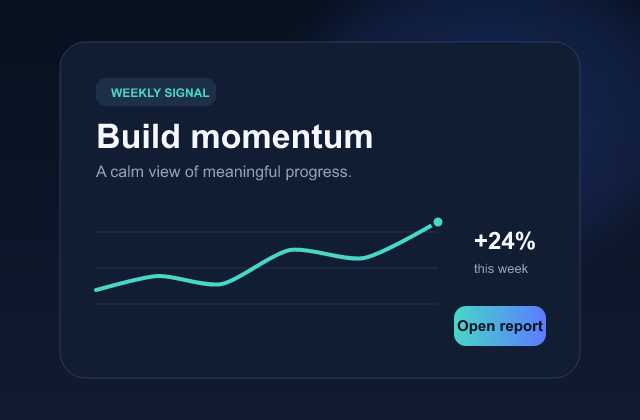
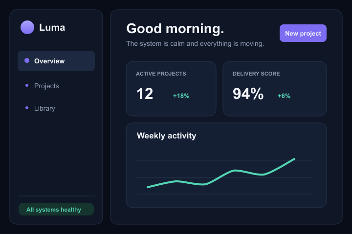
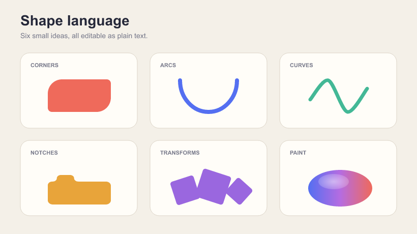
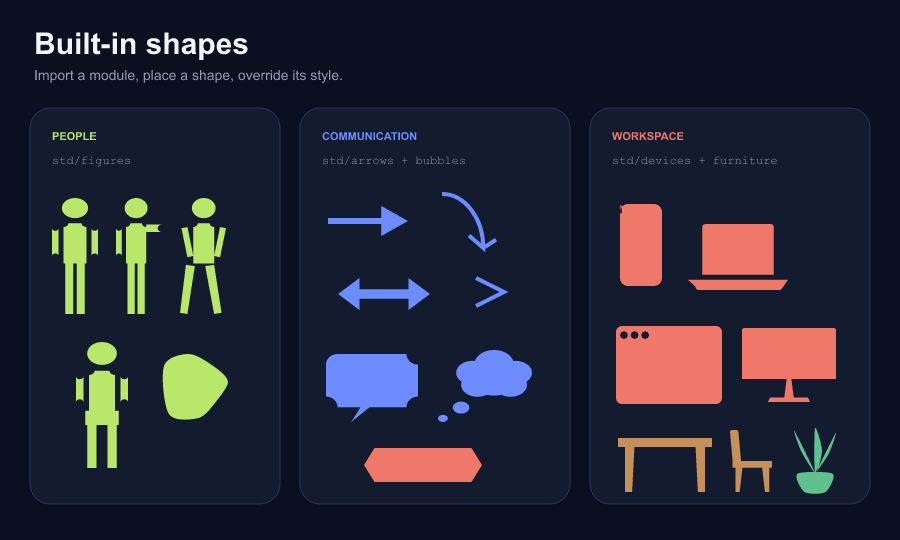

# Examples

Every example pairs editable `.strok` source with a checked-in PNG preview.
The source is the canonical version; the preview makes the gallery browsable
without installing Strøk.

## Start here

| Preview | What it demonstrates |
| --- | --- |
| [](card.strok) | [Product card](card.strok): gradients, rounded panels, paths, and compact data visualization. |
| [](design-system.strok) | [Design system](design-system.strok): tokens, reusable components, a full dashboard, and framework export. |
| [](shape-language.strok) | [Shape language](shape-language.strok): corners, arcs, curves, notches, transforms, and paint. |
| [](std-library.strok) | [Built-in library](std-library.strok): figures, arrows, bubbles, devices, and furniture. |

## Illustration

| Preview | Source |
| --- | --- |
| [](tea.strok) | [Quiet Hour](tea.strok), an editorial still life built from layered vector shapes. |
| [](rose-v3.strok) | [Rose](rose-v3.strok), a compact organic illustration with reusable petal shapes. |
| [](pelican-on-a-bicycle.strok) | [Pelican on a bicycle](pelican-on-a-bicycle.strok), a playful scene with articulated geometry. |
| [](field-test/launch-day.strok) | [Launch day](field-test/launch-day.strok), a dense poster-style field test. |

[`button.strok`](button.strok) is the smallest example: a single polished call
to action suitable for a first edit.

## Render an example

```sh
cargo run -p strok-cli -- -f examples/card.strok render --out /tmp/card.png
```

After installing the CLI, the shorter form is:

```sh
strok -f examples/card.strok render --out /tmp/card.png
```

Run `just examples` to regenerate every checked-in preview.

The design-system example can also generate implementation artifacts:

```sh
strok -f examples/design-system.strok emit react --out /tmp/luma-react
strok -f examples/design-system.strok emit dtcg --out /tmp/luma-tokens
```
